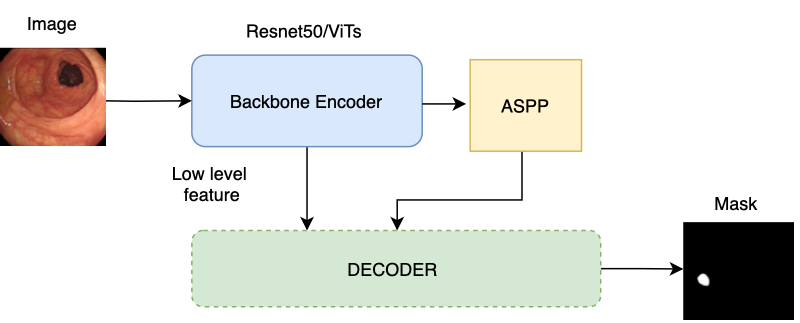
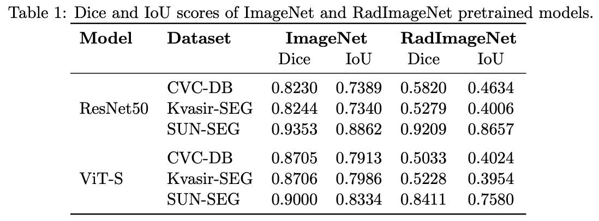
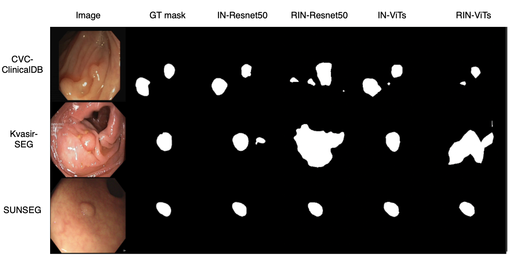

# Is Medical Pretraining Enough When the Modality Is Different? A Study on Endoscopic Polyp Segmentation

This project presents a comparative analysis of **ImageNet** and **RadImageNet** as pretraining sources for **endoscopic image segmentation**, using both **ResNet-50** (CNN) and **ViT-Small** (Vision Transformer) encoder architectures. These backbone encoders are integrated into a DeepLabV3+ decoder to generate the output segmentation mask. We evaluate the impact of **domain** and **modality alignment** in transfer learning across three publicly available polyp segmentation datasets: **CVC-ClinicDB**, **Kvasir-SEG**, and **SUN-SEG**.

---

## 🔍 Overview

**Figure 1:** Architectural overview of ResNet-50 and ViT-Small encoders integrated into a DeepLabV3+ decoder.

---

## 📊 Results Summary

**Figure 2:** Quantitative performance (Dice and IoU) across datasets and pretraining sources.

---

## 🎯 Sample Predictions

**Figure 3:** Predicted masks from ImageNet (IN) and RadImageNet (RIN) pretrained models.

---

## 📁 Code Availability

The code for model training, evaluation, and visualization will be released **after peer review**.

---

## 📜 Citation

If you find this work useful, please consider citing our paper (coming soon).

---

## 📬 Contact

For questions or collaborations, feel free to open an issue or reach out.

---
