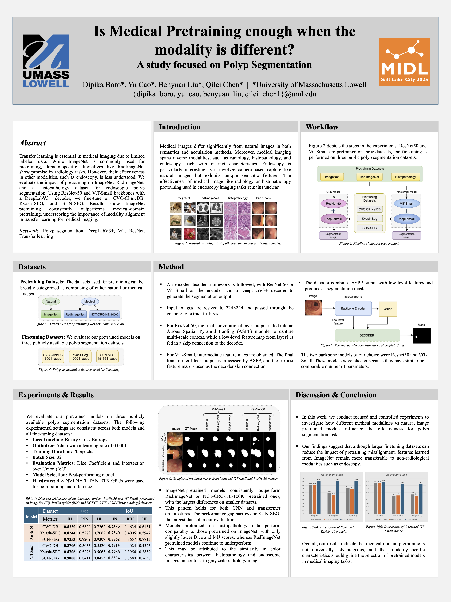

# Is Medical Pretraining Enough When the Modality Is Different?
### A Study on Endoscopic Polyp Segmentation

**Dipika Boro, Yu Cao, Benyuan Liu, Qilei Chen**  
**Presented at MIDL 2025 (Short Paper Track)**

---

## 🔍 Overview

This project presents a comparative analysis of **ImageNet** vs **RadImageNet** or **Histopathology** images as pretraining sources for **endoscopic image segmentation**, using both **ResNet-50** (CNN) and **ViT-Small** (Vision Transformer) encoder architectures. These backbone encoders are integrated into a **DeepLabV3+** decoder to generate the output segmentation mask.

We evaluate the impact of **domain** and **modality alignment** in transfer learning across three publicly available polyp segmentation datasets:

- **CVC-ClinicDB**
- **Kvasir-SEG**
- **SUN-SEG**

---

## ✨ Highlights

- First systematic comparison of **ImageNet vs RadImageNet or Histopathology images** for **endoscopic polyp segmentation**
- Evaluation across **three benchmark datasets**
- Analysis of **domain vs modality alignment** in transfer learning
- Comparison of **CNN (ResNet-50)** and **Transformer (ViT-Small)** backbones

---

## 📄 Paper

[Download the poster (PDF)](poster/poster.pdf)

This work was presented as a **poster at MIDL 2025 (Short Paper Track)**.

- 📄 **Paper (OpenReview):** [Read PDF](https://openreview.net/pdf?id=mf46VVoZoG)

---

## 🖼️ Poster

<p align="center">
    
</p>

---

## 📌 Status

- ✅ Presented at **MIDL 2025 (Poster)**
- 📄 Paper available on **OpenReview**

---

## 📜 Citation

If you find this work useful, please cite:

```bibtex
@inproceedings{boro2025medicalpretraining,
  title={Is Medical Pretraining Enough When the Modality Is Different? A Study on Endoscopic Polyp Segmentation},
  author={Boro, Dipika and Cao, Yu and Liu, Benyuan and Chen, Qilei},
  booktitle={Medical Imaging with Deep Learning (MIDL)},
  year={2025},
  note={Short paper, presented as poster. Available on OpenReview}
}
